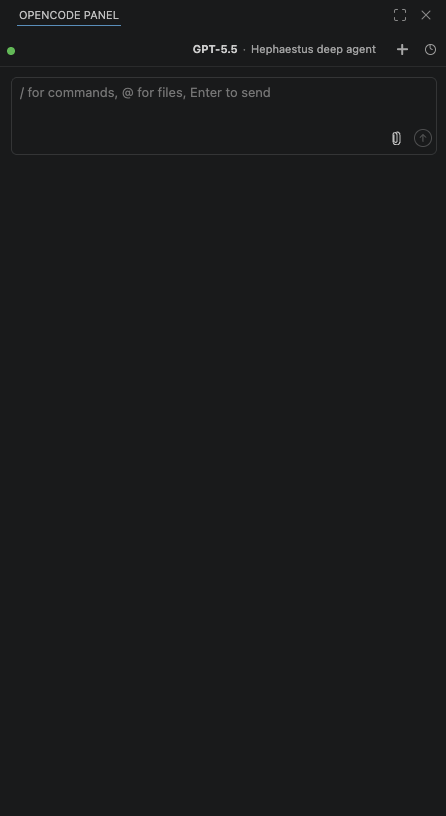
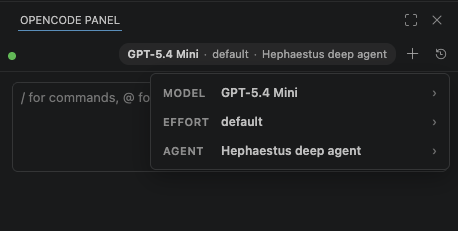
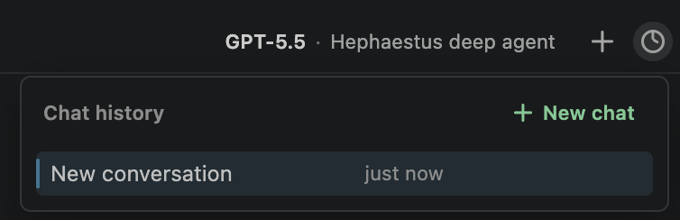
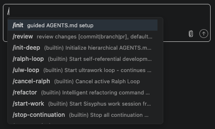
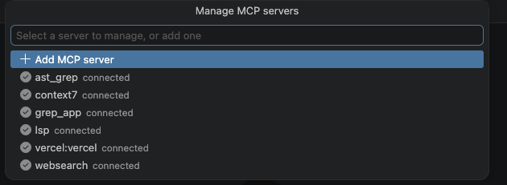
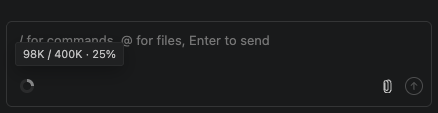

# OpenCode Panel

> A React chat sidebar for AI coding in VS Code, powered by
> [opencode](https://github.com/sst/opencode). Bring your own model
> (Anthropic / OpenAI / Gemini / local). Everything runs locally — nothing
> leaves your machine except the API call to your chosen provider.

<table>
<tr>
<td width="50%" align="center">
  <br>
  <sub><b>Welcome panel</b></sub>
</td>
<td width="50%" align="center">
  <br>
  <sub><b>Model · Agent · Effort picker</b></sub>
</td>
</tr>
<tr>
<td align="center">
  <br>
  <sub><b>Per-workspace chat history</b></sub>
</td>
<td align="center">
  <br>
  <sub><b>Slash commands</b></sub>
</td>
</tr>
<tr>
<td align="center">
  <br>
  <sub><b>Manage MCP servers</b></sub>
</td>
<td align="center">
  <br>
  <sub><b>Context-window usage</b></sub>
</td>
</tr>
</table>

## Highlights

- **Streaming chat** with reasoning blocks and an inline tool-call trace.
- **`@file` mentions** — fuzzy picker with chip-styled tokens; recently-opened files boosted.
- **Image / PDF attachments** — paperclip + clipboard paste; images render as preview thumbnails.
- **Edit + regenerate** — click any past user message; the conversation rewinds via opencode's `session.revert`.
- **Review Changes** card per file with `Keep` / `Undo` (per row + Keep / Undo all).
- **Inline edit** with `Cmd+K` / `Ctrl+K` — rewrite selection with natural language.
- **Effort / reasoning-budget picker** for models that expose variants (gpt-5.5, claude-opus, etc.).
- **Math, tables, lists** render properly in assistant messages (LaTeX, GFM, KaTeX).

## Setup

OpenCode Panel talks to a locally-running [opencode](https://opencode.ai) server. One-time prerequisite:

```bash
# Install opencode (pick one)
curl -fsSL https://opencode.ai/install | bash      # macOS / Linux
irm https://opencode.ai/install.ps1 | iex          # Windows
npm install -g opencode-ai                         # any platform
brew install sst/tap/opencode                      # macOS Homebrew

# Sign in to your provider (one time)
opencode auth login
```

Then install the extension:

```bash
code --install-extension haoyangzeng.opencui
```

Or search **"OpenCode Panel"** in the VS Code Extensions sidebar. Open the panel via the activity-bar icon or `Cmd+L` / `Ctrl+L`.

If `opencode` isn't on `PATH`, set `opencui.binaryPath` in settings to its absolute path.

## Settings

| Setting | Default | Description |
|---|---|---|
| `opencui.binaryPath` | `opencode` | Path to the opencode binary. |
| `opencui.serverPort` | `0` | Local opencode HTTP port (`0` = auto). |
| `opencui.model` | `""` | Default model (`providerID/modelID`). Change at runtime via the chat header. |

## Develop

```bash
bun install
bun run watch         # esbuild + vite single-file
```

Open the folder in VS Code and press `F5` to launch an Extension Development Host. See [CLAUDE.md](./CLAUDE.md) for architecture notes and the test layout.

## License

MIT. See [LICENSE](./LICENSE).
